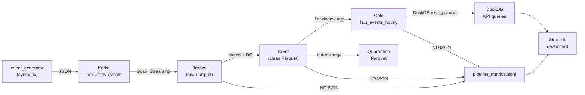

# NexusFlow-X

Local-first, Docker-based **streaming data platform**: synthetic events → **Kafka** → **Spark Structured Streaming** → **Parquet** (Bronze → Silver → Gold) → **DuckDB analytics** and **Streamlit dashboard**, with YAML-driven data quality enforcement and quarantine paths.

## Architecture



## Quick start

1. Install [Docker](https://docs.docker.com/get-docker/) with Compose.
2. Clone the repo and run:

   ```bash
   docker compose up -d
   ```

3. Follow **[docs/LOCAL_RUNBOOK.md](docs/LOCAL_RUNBOOK.md)** for topics, `spark-submit`, and the producer.
4. After data lands in Gold, query it or open the dashboard:

   ```bash
   pip install -r requirements.txt
   python analytics/gold_query.py        # CLI KPI report
   streamlit run analytics/dashboard.py  # browser dashboard at localhost:8501
   ```

See **[docs/DEMO_SCRIPT.md](docs/DEMO_SCRIPT.md)** for a full 5-minute walkthrough.

**Tests:** `python -m pytest tests/ -q` (also `make test`). CI runs the same on push/PR. PySpark-backed tests are skipped on Python 3.13+ (use 3.10-3.12 or rely on CI).

**Operator shortcuts:** [Makefile](Makefile) -- `make up`, `make bronze`, `make producer`, `make silver`, `make gold`, `make query`, `make dashboard`, `make test`, `make validate`. Use **WSL or Git Bash** on Windows if `make` is not installed.

**Recovery / checkpoints:** [docs/RECOVERY.md](docs/RECOVERY.md)

## Layout

| Path | Role |
|------|------|
| `ingestion/` | Producer, event generator, data quality helpers, `quality_rules.yaml` |
| `streaming/` | Bronze, Silver, Gold Spark jobs |
| `analytics/` | DuckDB query layer and Streamlit dashboard |
| `data/` | Parquet output, checkpoints, metrics (generated at runtime, gitignored) |
| `tests/` | Unit + contract tests (pytest) |
| `scripts/` | `spark_submit_*.sh`, `run_gold.sh` helpers |

